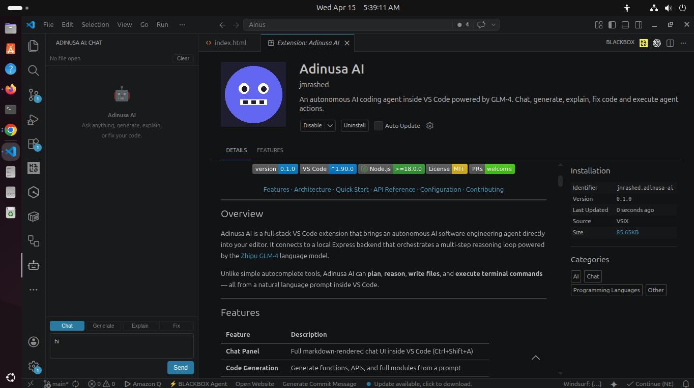

<div align="center">


# Adinusa AI

**An autonomous AI coding agent inside Visual Studio Code, powered by multiple LLM providers.**

[](https://github.com/jmrashed/adinusa-ai/releases)
[](https://code.visualstudio.com/)
[](https://nodejs.org/)
[](./LICENSE)
[](./CONTRIBUTING.md)

[Features](#-features) · [Architecture](#-architecture) · [Quick Start](#-quick-start) · [API Reference](#-api-reference) · [Configuration](#-configuration) · [Contributing](#-contributing)

</div>

---

## Overview

Adinusa AI is a full-stack VS Code extension that brings an autonomous AI software engineering agent directly into your editor. It connects to a local Express backend that orchestrates a multi-step reasoning loop powered by your choice of LLM provider — **GLM-4, OpenAI GPT-4, Anthropic Claude, Google Gemini, or Ollama (local models)**.

Unlike simple autocomplete tools, Adinusa AI can **plan**, **reason**, **write files**, and **execute terminal commands** — all from a natural language prompt inside VS Code.



---

## Features

| Feature | Description |
|---|---|
| **Chat Panel** | Full markdown-rendered chat UI inside VS Code (Ctrl+Shift+A) |
| **Intent Selector** | Switch between Chat, Generate, Explain, and Fix modes inside the sidebar |
| **Code Generation** | Generate functions, APIs, and full modules from a prompt |
| **Code Explanation** | Explain any selected code in plain language |
| **Code Fixing** | Fix selected buggy or broken code automatically |
| **Editor Context** | Sends active file content and selection to the AI automatically |
| **Active File Indicator** | Toolbar shows the currently open file; updates on every tab switch |
| **Agent Actions** | Inline Apply / Skip card inside the AI reply — no popup interruption |
| **Copy Code** | One-click copy button on every code block in AI replies |
| **Timestamps** | Every message shows the time it was sent |
| **Multi-Provider** | Switch between GLM-4, GPT-4, Claude, Gemini, or Ollama at any time |
| **Status Bar** | One-click access to the chat panel from the VS Code status bar |
| **Keybindings** | Full keyboard shortcut support for all commands |

---

## Architecture

```
┌─────────────────────────────────────────────┐
│           VS Code Extension                  │
│                                             │
│  ┌──────────┐  ┌──────────┐  ┌──────────┐  │
│  │ Chat UI  │  │ Commands │  │ Services │  │
│  │ (Webview)│  │ Ask      │  │ Context  │  │
│  │ Markdown │  │ Generate │  │ Editor   │  │
│  │ Rendering│  │ Explain  │  │ Actions  │  │
│  └────┬─────┘  │ Fix      │  │ Model    │  │
│       │        │ Switch   │  └──────────┘  │
└───────┼─────────────┼────────────────────--┘
        │             │  HTTP POST /ai/chat
        ▼             ▼
┌─────────────────────────────────────────────┐
│           Express Backend                    │
│                                             │
│  ┌──────────────────────────────────────┐   │
│  │           Agent Loop                 │   │
│  │  User Message → LLM → Parse JSON     │   │
│  │  → Execute Tools → Feedback → Repeat │   │
│  └──────────────────────────────────────┘   │
│                                             │
│  Tools: write_file · read_file · run_cmd    │
│  Security: helmet · rate-limit · validation │
└───────────────────┬─────────────────────────┘
                    │  HTTPS
                    ▼
        ┌───────────────────────────────────┐
        │   LLM Providers                   │
        │   GLM-4 · GPT-4 · Claude          │
        │   Gemini · Ollama (local)         │
        └───────────────────────────────────┘
```

---

## Project Structure

```
adinusa-ai/                         # Monorepo root
│
├── adinusa-ai/                     # VS Code Extension (TypeScript)
│   ├── src/
│   │   ├── extension.ts            # Entry point + status bar
│   │   ├── commands/
│   │   │   └── index.ts            # Ask, Generate, Explain, Fix, SwitchProvider
│   │   ├── services/
│   │   │   ├── api.service.ts      # HTTP client → backend
│   │   │   ├── context.service.ts  # Active file + selection reader
│   │   │   ├── editor.service.ts   # Insert / replace code in editor
│   │   │   ├── action.service.ts   # Apply agent file/terminal actions
│   │   │   └── model.service.ts    # Provider config + validation
│   │   ├── ui/
│   │   │   ├── panel.ts            # Floating webview chat panel
│   │   │   ├── chat.view.ts        # Sidebar webview view provider
│   │   │   └── manual.ts           # Manual/help panel
│   │   ├── config/
│   │   │   └── settings.ts         # VS Code settings reader
│   │   └── utils/
│   │       └── logger.ts           # Output channel logger
│   ├── .vscode/
│   │   ├── launch.json             # F5 debug config
│   │   └── tasks.json              # Build task
│   ├── package.json
│   ├── tsconfig.json
│   └── esbuild.js
│
├── backend/                        # Agent Server (Node.js / Express)
│   ├── src/
│   │   ├── app.js                  # Express entry, middleware, routes
│   │   ├── controllers/
│   │   │   └── ai.controller.js    # Request validation + response
│   │   ├── routes/
│   │   │   └── ai.routes.js        # POST /ai/chat
│   │   ├── services/
│   │   │   ├── agent.service.js    # Multi-step agent loop
│   │   │   └── llm.service.js      # Multi-provider LLM router
│   │   ├── tools/
│   │   │   ├── file.tool.js        # Safe file read/write
│   │   │   └── terminal.tool.js    # Sandboxed command execution
│   │   ├── memory/                 # Agent memory (future use)
│   │   ├── prompts/
│   │   │   └── system.prompt.js    # Agent system prompt
│   │   └── utils/
│   │       └── logger.js
│   ├── Dockerfile
│   ├── .env.example
│   └── package.json
│
├── scripts/
│   ├── install.sh                  # Install all dependencies
│   └── dev.sh                      # Start backend + extension watcher
│
├── docker-compose.yml
├── pnpm-workspace.yaml
├── CHANGELOG.md
├── CONTRIBUTING.md
├── LICENSE
└── README.md
```

---

## Quick Start

### Prerequisites

- [Node.js](https://nodejs.org/) >= 18.0.0
- [VS Code](https://code.visualstudio.com/) >= 1.90.0
- An API key for at least one supported provider (see [Configuration](#configuration))

### 1. Clone the repository

```bash
git clone https://github.com/jmrashed/adinusa-ai.git
cd adinusa-ai
```

### 2. Configure the backend

```bash
cp backend/.env.example backend/.env
```

Edit `backend/.env` and set your API key(s):

```env
PORT=3002
MAX_AGENT_ITERATIONS=5
RATE_LIMIT=30
ALLOWED_ORIGINS=vscode-webview://*

# Default provider (glm | openai | claude | gemini | ollama)
DEFAULT_PROVIDER=glm

# Zhipu GLM
ZHIPU_API_KEY=your_glm_api_key_here
GLM_MODEL=glm-4-flash

# OpenAI
OPENAI_API_KEY=your_openai_api_key_here

# Anthropic Claude
ANTHROPIC_API_KEY=your_anthropic_api_key_here

# Google Gemini
GEMINI_API_KEY=your_gemini_api_key_here

# Ollama (local — no key required)
OLLAMA_BASE_URL=http://localhost:11434
```

### 3. Install dependencies

```bash
bash scripts/install.sh
```

### 4. Start the backend

```bash
cd backend && npm run dev
```

Verify it's running:

```bash
curl http://localhost:3002/health
# {"status":"ok","version":"0.1.0"}
```

### 5. Launch the extension

Open the `adinusa-ai/` folder in VS Code and press **F5**.

A new **Extension Development Host** window opens. You'll see the `$(robot) Adinusa AI` item in the status bar.

---

## Usage

### Open Chat Panel

Press `Ctrl+Shift+A` (Mac: `Cmd+Shift+A`) or click the status bar item.

Type any message and press `Enter`. The AI responds with markdown-rendered output including syntax-highlighted code blocks.

### Commands

| Command | Shortcut | Description |
|---|---|---|
| `Adinusa AI: Open Chat` | `Ctrl+Shift+A` | Open the chat panel |
| `Adinusa AI: Ask` | `Ctrl+Shift+/` | Quick question via input box |
| `Adinusa AI: Generate Code` | `Ctrl+Shift+G` | Generate code at cursor |
| `Adinusa AI: Explain Selection` | `Ctrl+Shift+E` | Explain selected code |
| `Adinusa AI: Fix Selection` | `Ctrl+Shift+F` | Fix selected code |
| `Adinusa AI: Switch AI Provider` | `Ctrl+Shift+P` | Switch the active LLM provider |
| `Adinusa AI: Open Manual` | `Ctrl+Shift+M` | Open the help/manual panel |

All commands are also available via right-click context menu in the editor.

### Agent Actions

When the AI decides to create files or run commands, an inline confirmation card appears directly inside the AI reply bubble:

```
⚡ AI wants to run 2 action(s).
[ Apply ]  [ Skip ]
```

- **Apply** — files are created and opened in the editor; commands run in a new terminal
- **Skip** — actions are discarded; only the text reply is kept

---

## API Reference

### `POST /ai/chat`

Send a message to the agent.

**Request**

```json
{
  "message": "Create a Node.js Express REST API with CRUD for users",
  "intent": "generate",
  "context": {
    "fileName": "/path/to/current/file.ts",
    "file": "// current file content (truncated to 4000 chars)",
    "selection": "// selected code (optional)",
    "intent": "generate"
  },
  "modelConfig": {
    "provider": "openai",
    "apiKey": "<your_key>",
    "model": "gpt-4o"
  }
}
```

**Response**

```json
{
  "reply": "Here is the generated Express API...",
  "actions": [
    {
      "tool": "write_file",
      "path": "src/routes/users.js",
      "content": "const express = require('express');\n..."
    }
  ]
}
```

**Error responses**

| Status | Meaning |
|---|---|
| `400` | Missing/invalid `message`, or unknown `provider` |
| `429` | Rate limit exceeded (30 req/min) |
| `500` | Agent or LLM error (message forwarded from provider) |

### `GET /health`

```json
{ "status": "ok", "version": "0.1.0" }
```

---

## Configuration

### VS Code Settings

Open VS Code Settings (`Ctrl+,`) and search for `Adinusa` to configure, or use `Adinusa AI: Switch AI Provider` command.

| Setting | Default | Description |
|---|---|---|
| `adinusaAi.backendUrl` | `http://localhost:3002` | Backend API URL |
| `adinusaAi.provider` | `glm` | Active provider: `glm` · `openai` · `claude` · `gemini` · `ollama` |
| `adinusaAi.glm.apiKey` | — | Zhipu AI API key |
| `adinusaAi.glm.model` | `glm-4-flash` | GLM model name |
| `adinusaAi.openai.apiKey` | — | OpenAI API key |
| `adinusaAi.openai.model` | `gpt-4o` | OpenAI model name |
| `adinusaAi.claude.apiKey` | — | Anthropic API key |
| `adinusaAi.claude.model` | `claude-3-5-sonnet-20241022` | Claude model name |
| `adinusaAi.gemini.apiKey` | — | Google AI API key |
| `adinusaAi.gemini.model` | `gemini-1.5-pro` | Gemini model name |
| `adinusaAi.ollama.baseUrl` | `http://localhost:11434` | Ollama base URL |
| `adinusaAi.ollama.model` | `llama3` | Ollama model name |

### Backend Environment Variables

| Variable | Default | Description |
|---|---|---|
| `DEFAULT_PROVIDER` | `glm` | Default LLM provider |
| `PORT` | `3002` | Server port |
| `MAX_AGENT_ITERATIONS` | `5` | Max agent reasoning steps (hard cap: 10) |
| `RATE_LIMIT` | `30` | Max requests per minute per IP |
| `ALLOWED_ORIGINS` | `vscode-webview://*` | Comma-separated CORS origins |
| `ZHIPU_API_KEY` | — | Zhipu GLM API key |
| `GLM_MODEL` | `glm-4-flash` | GLM model to use |
| `OPENAI_API_KEY` | — | OpenAI API key |
| `ANTHROPIC_API_KEY` | — | Anthropic Claude API key |
| `GEMINI_API_KEY` | — | Google Gemini API key |
| `OLLAMA_BASE_URL` | `http://localhost:11434` | Ollama base URL |

---

## Docker

Run the backend with Docker:

```bash
# Build and start
docker-compose up -d

# View logs
docker-compose logs -f backend

# Stop
docker-compose down
```

Or build manually:

```bash
cd backend
docker build -t adinusa-ai-backend .
docker run -p 3002:3002 --env-file .env adinusa-ai-backend
```

### Production Deployment

For production use, consider the following:

1. **Use HTTPS** — Configure a reverse proxy (nginx, Traefik, Caddy) with TLS certificates.
2. **Set strong rate limits** — Adjust `RATE_LIMIT` and consider per-user limits after implementing auth.
3. **Enable structured JSON logging** — Set `LOG_FORMAT=json` and ship logs to a central system.
4. **Use secret management** — Store API keys in Kubernetes Secrets, Docker secrets, or a vault.
5. **Resource limits** — Apply CPU/memory constraints (see `k8s/backend-deployment.yaml`).
6. **Monitor with Prometheus** — Export metrics endpoint (TODO).
7. **Graceful shutdown** — Already supported; ensure `SIGTERM` is handled.
8. **Run as non-root** — Dockerfile uses non-root user `nodejs`.

### Kubernetes

A sample Kubernetes manifest is provided in `k8s/backend-deployment.yaml`. It includes:

- Deployment with 1 replica (scale as needed)
- ClusterIP Service
- Ingress (adjust host)
- ConfigMap and Secret for environment
- Health probes

Apply with:

```bash
kubectl apply -f k8s/backend-deployment.yaml
```

Ensure you replace placeholder secret values with real API keys.

### Process Managers

For VM or bare-metal deployments, use PM2:

```bash
cd backend
pnpm add -g pm2
pm2 start ecosystem.config.js
pm2 save
pm2 startup
```

The `ecosystem.config.js` runs the app in cluster mode across all CPU cores with log rotation.

---

## Security

- **Path traversal protection** — all file operations are restricted to the workspace root
- **Command blocklist** — destructive commands (`rm -rf`, `mkfs`, `dd`, `shutdown`) are blocked
- **Rate limiting** — 30 requests/minute per IP via `express-rate-limit`
- **HTTP security headers** — enforced via `helmet`
- **Input validation** — message type, length (max 8000 chars), and presence are validated
- **CORS** — restricted to configured origins only
- **Secrets** — `.env` is gitignored; only `.env.example` is committed

---

## API Documentation

The backend API is documented using OpenAPI 3.0. You can view the full specification:

- **[OpenAPI YAML](./backend/openapi.yaml)** — Machine-readable API contract
- Interactive documentation (coming soon with Swagger UI)

Endpoints:
- `GET /health` — Health check
- `POST /ai/chat` — Send a message to the AI agent

---

## FAQ & Troubleshooting

### Common Issues

**Q: The extension shows "Backend connection failed"**

A: Ensure the backend server is running on `http://localhost:3002` (or your configured `adinusaAi.backendUrl`). Check:
```bash
curl http://localhost:3002/health
```
If it fails, start the backend: `cd backend && npm run dev`

**Q: I get "workspaceRoot is required" error**

A: Open a workspace folder in VS Code (File → Open Folder). The agent needs a workspace to operate in.

**Q: My API key isn't working**

A: 
1. Verify the key is correctly set in VS Code settings (not just in `.env`)
2. For GLM: keys are from https://open.bigmodel.cn
3. For OpenAI: keys are from https://platform.openai.com/api-keys
4. Ensure no extra spaces or quotes in the key

**Q: The agent says "command not found" or fails to execute commands**

A:
- Commands run in the workspace's shell environment
- On Windows, use `cmd` or PowerShell syntax; on macOS/Linux use bash
- Some commands (like `rm -rf /`) are blocked for security

**Q: Rate limit errors (429)**

A: Default is 30 requests per minute. Increase `RATE_LIMIT` in `backend/.env` or wait a minute.

**Q: Agent loops indefinitely or times out**

A: The agent has a maximum iteration limit (default 5). Adjust `MAX_AGENT_ITERATIONS` in `backend/.env` (max 10).

**Q: File writes fail with permission denied**

A: The agent writes files within the workspace only. Ensure the workspace directory is writable.

**Q: No response from the AI (timeout)**

A:
- Check your API key is valid and has quota
- Verify network connectivity to the LLM provider
- The backend has a default timeout; check logs for details

**Q: How do I view backend logs?**

A: Backend logs appear in the terminal where you ran `npm run dev`. For production, configure proper logging (e.g., Winston + file transport).

**Q: The extension doesn't activate / commands don't appear**

A: Reload VS Code (`Ctrl+R` or `Developer: Reload Window`). Ensure the extension is installed and enabled.

**Q: Type errors on build**

A: Run `pnpm install` in both `adinusa-ai/` and `backend/` directories, or use `bash scripts/install.sh` from the repo root.

---

## Security

See [SECURITY.md](./SECURITY.md) for vulnerability reporting and best practices.

---

## Roadmap

- [ ] Streaming responses (SSE / WebSocket)
- [ ] RAG — project-level context memory (FAISS / Pinecone)
- [ ] Git integration (auto-commit, diff review)
- [ ] Error fixing loop (run → catch error → auto-fix)
- [ ] VS Code Marketplace publish
- [ ] Voice input support
- [ ] Team collaboration mode
- [x] Multi-provider support (GLM-4, GPT-4, Claude, Gemini, Ollama)
- [x] Intent selector (Chat / Generate / Explain / Fix)
- [x] Inline action confirmation in chat
- [x] Copy code button on code blocks
- [x] Message timestamps
- [x] Active file context indicator
- [x] Backend health check banner with retry

---

## Contributing

Contributions are welcome. Please read [CONTRIBUTING.md](./CONTRIBUTING.md) for setup instructions and guidelines.

```bash
# Fork → clone → branch
git checkout -b feat/your-feature

# Make changes, then
cd adinusa-ai && npm run check-types

# Commit and open a PR
git commit -m "feat: your feature description"
```

---

## Release Notes

### 0.2.0 — 2026-04-15

- Intent selector (Chat / Generate / Explain / Fix) in the sidebar chat toolbar
- Inline action confirmation card replaces the VS Code notification popup
- Copy button on every fenced code block
- Animated thinking indicator (three bouncing dots)
- Timestamp on every message
- Active file context indicator in the toolbar, updated on every editor tab switch
- Clear chat button
- Backend health check banner with Retry button
- Auto-focus and auto-resize textarea
- Fixed `msg` variable shadowing bug in the webview message handler

### 0.1.0 — 2025-04-15

- Initial release

---

## License

[MIT](./LICENSE) © 2025 Adinusa AI
